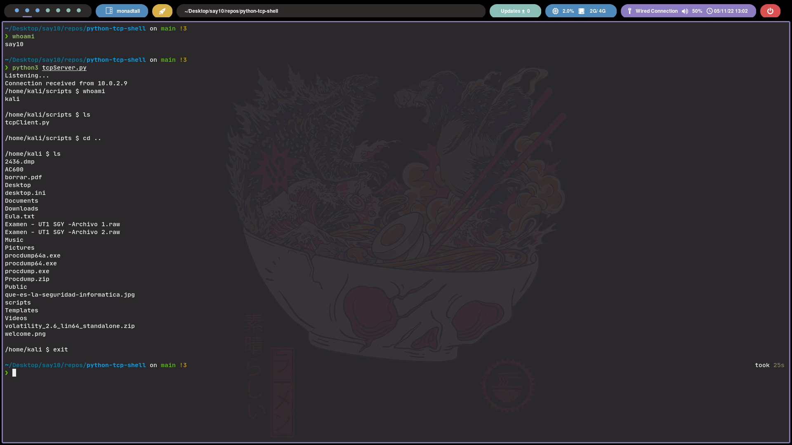

# Small Python reverse shell 

Executing both of these files gives the server side control of the client side.
Server IP needs to be specified in the client script.
Improvements and extra functionalities may be added in the future.

